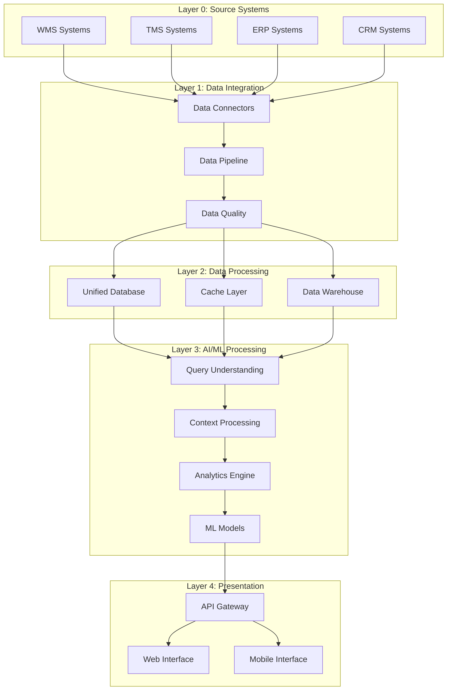
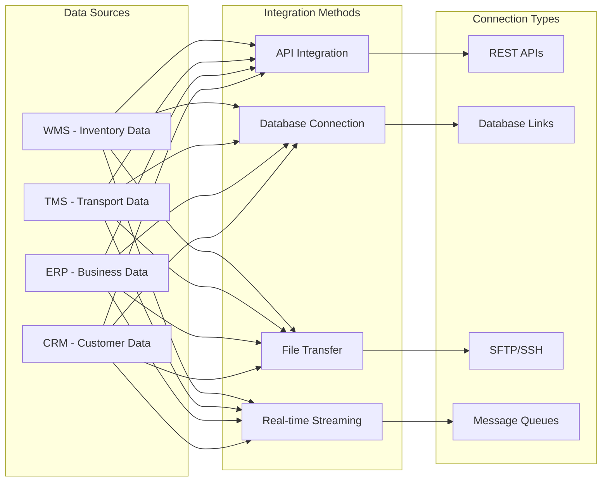
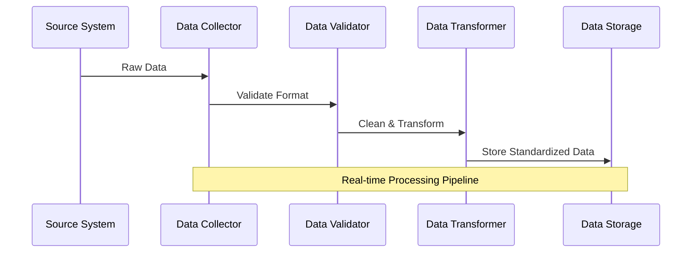
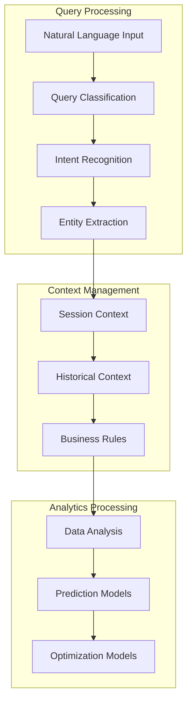
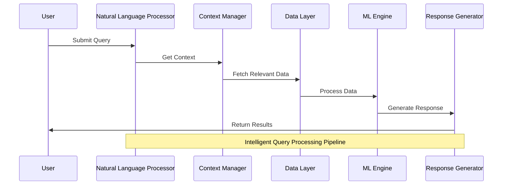
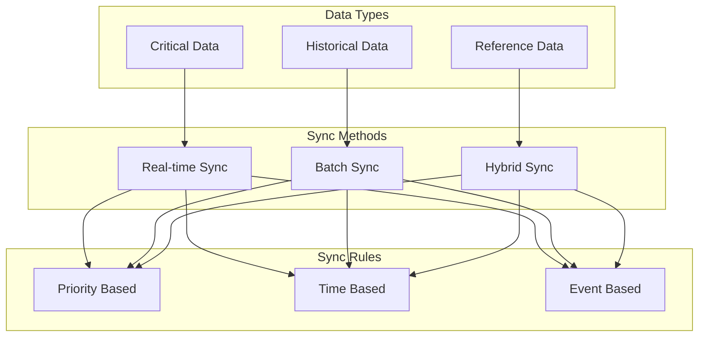
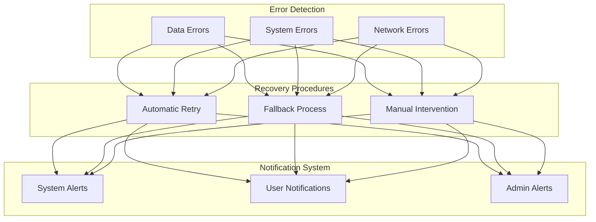
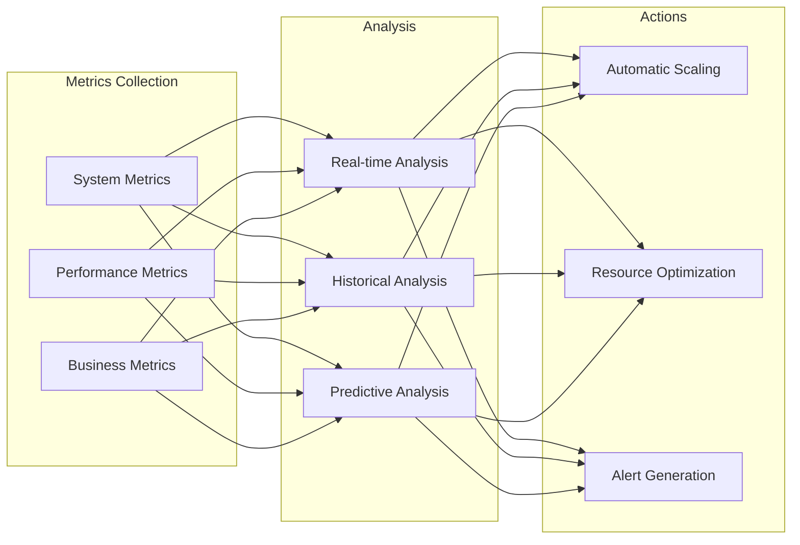
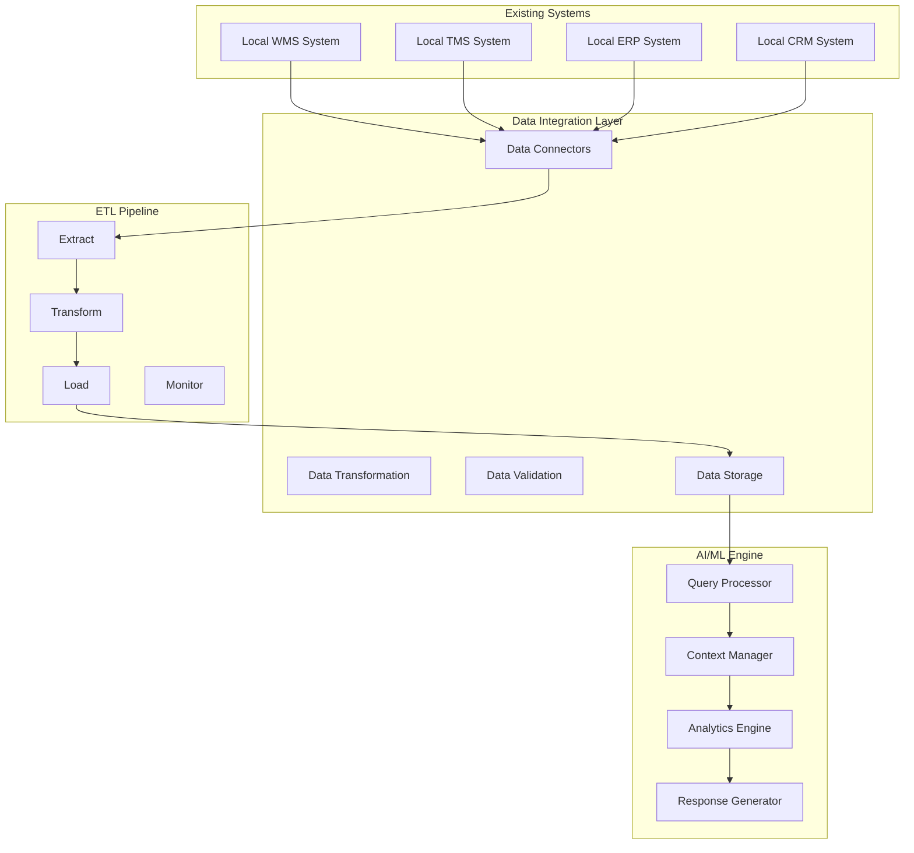

# AI Logistics Platform - Comprehensive System Architecture

## 1. System Overview

The AI Logistics Platform is designed to integrate with various existing logistics systems, process data in real-time, and provide intelligent insights through natural language queries. Here's a detailed breakdown of each component:

### 1.1 Core System Components



## 2. Detailed Component Description

### 2.1 Source Systems Integration



### 2.2 Data Processing Pipeline



### 2.3 AI/ML Engine Architecture



## 3. Process Workflows

### 3.1 Query Processing Workflow



### 3.2 Data Synchronization Strategy



## 4. Error Handling and Recovery

### 4.1 Error Management System



## 5. System Monitoring and Performance

### 5.1 Monitoring Framework



## Key Features and Benefits:

1. **Intelligent Integration**

   - Flexible connection methods
   - Automated data synchronization
   - Real-time data processing

2. **Advanced Analytics**

   - Natural language query processing
   - Predictive analytics
   - Optimization algorithms

3. **Robust Architecture**

   - Scalable design
   - Error resilience
   - High availability

4. **Security and Compliance**

   - Data encryption
   - Access control
   - Audit logging

5. **Performance Optimization**
   - Caching strategies
   - Load balancing
   - Resource management

---

#### High-Level Architecture Workflow



#### Data Integration Layer

```
   graph LR
       A[Raw Data] --> B[Data Connectors]
       B --> C[Data Transformation]
       C --> D[Data Validation]
       D --> E[Unified Data Storage]
```

#### AI/ML Engine Workflow

```
   graph TB
       A[User Query] --> B[Query Processor]
       B --> C[Context Manager]
       C --> D[Analytics Engine]
       D --> E[Response Generator]
       F[Historical Data] --> C
       G[Real-time Data] --> C
```

#### Data Flow

```
   sequenceDiagram
       participant User
       participant AI Engine
       participant Data Layer
       participant ETL
       participant Local Systems

       User->>AI Engine: Ask question
       AI Engine->>Data Layer: Request data
       Data Layer->>ETL: Check data freshness
       ETL->>Local Systems: Pull latest data
       Local Systems->>ETL: Return data
       ETL->>Data Layer: Update data
       Data Layer->>AI Engine: Provide data
       AI Engine->>User: Return answer
```

#### Data Synchronization

```
   graph LR
       A[Real-time Sync] --> B[Batch Sync]
       B --> C[Manual Sync]
       C --> D[Hybrid Approach]
```

#### System Integration Method

```
   graph TB
       A[API Integration] --> D[Custom Connector]
       B[Database Direct] --> D
       C[File Transfer] --> D
       D --> E[Unified Data Layer]
```

#### Data Quality Management

```
   graph LR
       A[Validation Rules] --> B[Error Handling]
       B --> C[Data Cleaning]
       C --> D[Quality Monitoring]
```

#### Overall System Workflow

```
graph TB
    subgraph "Local Systems"
        WMS[WMS Database]
        TMS[TMS Database]
        ERP[ERP System]
        CRM[CRM System]
    end

    subgraph "Data Integration Layer"
        DI[Data Integrators]
        DC[Data Cleansing]
        DV[Data Validation]
        DS[Data Standardization]
    end

    subgraph "Unified Database"
        UD[Standardized Data Storage]
        Cache[Redis Cache]
    end

    subgraph "AI Processing Layer"
        NLP[Natural Language Processor]
        AN[Analytics Engine]
        ML[ML Models]
    end

    subgraph "User Interface"
        UI[Web Interface]
        API[API Gateway]
    end

    WMS --> DI
    TMS --> DI
    ERP --> DI
    CRM --> DI
    DI --> DC
    DC --> DV
    DV --> DS
    DS --> UD
    UD --> Cache
    Cache --> NLP
    NLP --> AN
    AN --> ML
    ML --> API
    API --> UI
```

#### Query Processing Workflow

```
sequenceDiagram
    participant User
    participant UI as Web Interface
    participant NLP as Query Processor
    participant DB as Unified Database
    participant AN as Analytics Engine
    participant Cache as Redis Cache

    User->>UI: Ask Question
    UI->>NLP: Process Query
    NLP->>Cache: Check Cached Response
    alt Cache Hit
        Cache-->>UI: Return Cached Result
    else Cache Miss
        NLP->>DB: Fetch Required Data
        DB->>AN: Process Data
        AN->>Cache: Store Result
        Cache-->>UI: Return Result
    end
    UI->>User: Show Response
```

#### Data Integration Workflow

```
graph LR
    subgraph "Source Systems"
        S1[WMS Data]
        S2[TMS Data]
        S3[ERP Data]
        S4[CRM Data]
    end

    subgraph "ETL Process"
        E[Extract]
        T[Transform]
        L[Load]
    end

    subgraph "Data Quality"
        V1[Validation]
        V2[Cleansing]
        V3[Standardization]
    end

    S1 --> E
    S2 --> E
    S3 --> E
    S4 --> E
    E --> V1
    V1 --> V2
    V2 --> V3
    V3 --> T
    T --> L
```

#### Real-time Processing Workflow

```
sequenceDiagram
    participant Source as Source System
    participant ETL as ETL Pipeline
    participant DB as Unified DB
    participant Engine as AI Engine
    participant UI as User Interface

    Source->>ETL: New Data
    ETL->>ETL: Validate & Transform
    ETL->>DB: Store Data
    Note over DB,Engine: Real-time Processing
    DB->>Engine: Trigger Analysis
    Engine->>UI: Update Insights
```

#### Error Handling Workflow

```
graph TB
    subgraph "Error Detection"
        E1[Data Format Error]
        E2[Connection Error]
        E3[Processing Error]
    end

    subgraph "Error Handling"
        H1[Retry Logic]
        H2[Data Recovery]
        H3[Fallback Process]
    end

    subgraph "Notification"
        N1[Alert Admin]
        N2[Log Error]
        N3[User Notification]
    end

    E1 --> H1
    E2 --> H2
    E3 --> H3
    H1 --> N1
    H2 --> N2
    H3 --> N3
```
