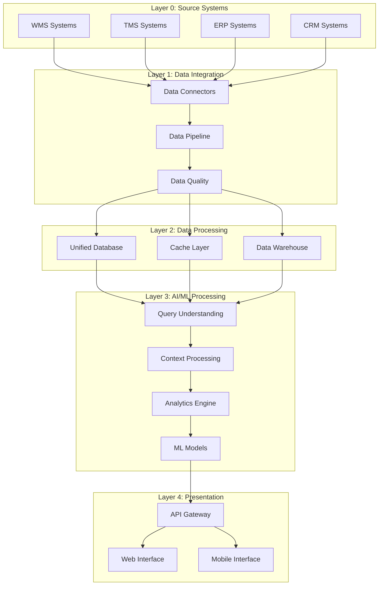
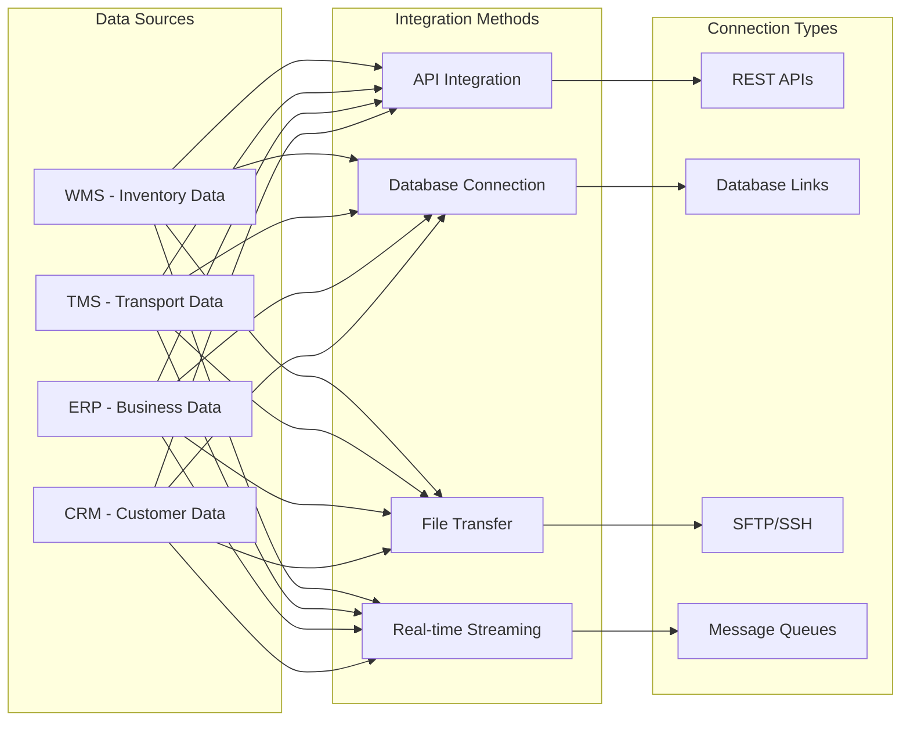
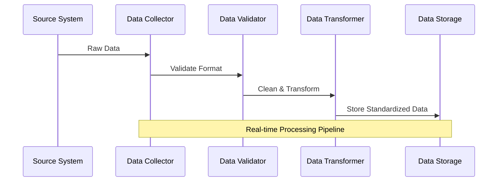
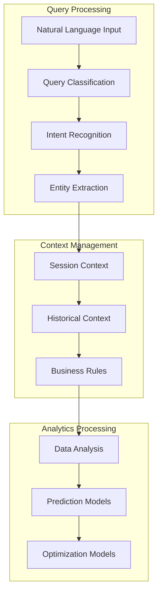
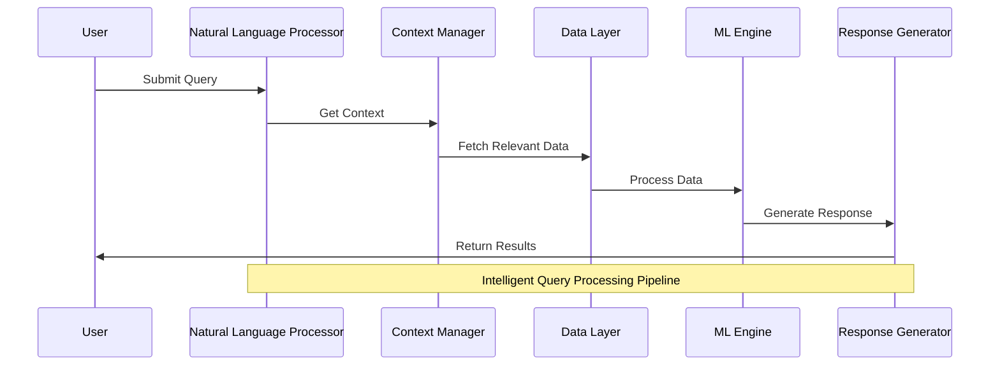
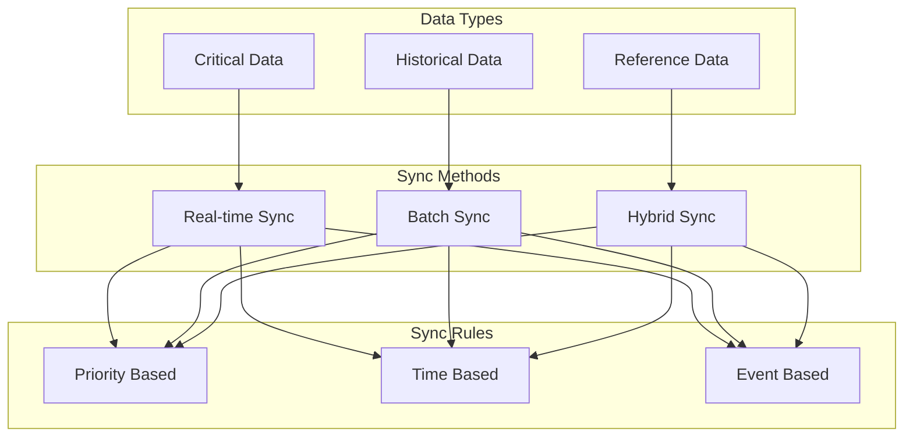
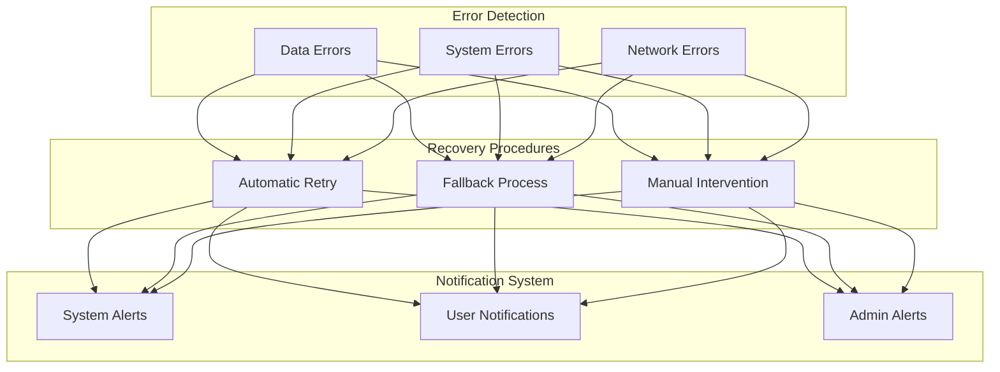
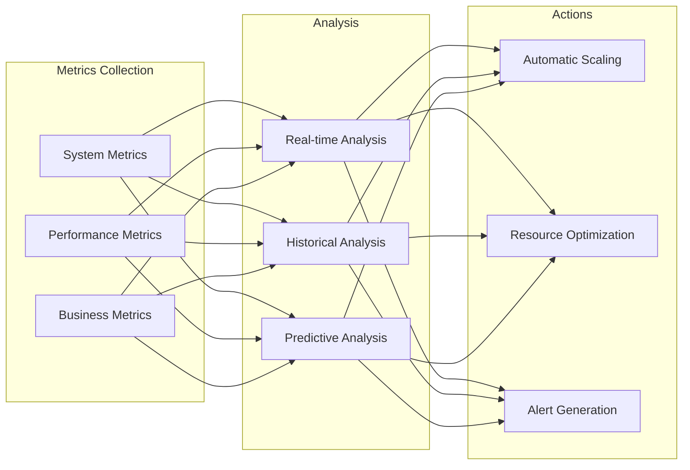

# AI Logistics Platform - Comprehensive System Architecture

## 1. System Overview

The AI Logistics Platform is designed to integrate with various existing logistics systems, process data in real-time, and provide intelligent insights through natural language queries. Here's a detailed breakdown of each component:

### 1.1 Core System Components

## 2. Detailed Component Description

### 2.1 Source Systems Integration

### 2.2 Data Processing Pipeline

### 2.3 AI/ML Engine Architecture

## 3. Process Workflows

### 3.1 Query Processing Workflow

### 3.2 Data Synchronization Strategy

## 4. Error Handling and Recovery

### 4.1 Error Management System

## 5. System Monitoring and Performance

### 5.1 Monitoring Framework

## Key Features and Benefits:

1. **Intelligent Integration**

   - Flexible connection methods
   - Automated data synchronization
   - Real-time data processing

2. **Advanced Analytics**

   - Natural language query processing
   - Predictive analytics
   - Optimization algorithms

3. **Robust Architecture**

   - Scalable design
   - Error resilience
   - High availability

4. **Security and Compliance**

   - Data encryption
   - Access control
   - Audit logging

5. **Performance Optimization**
   - Caching strategies
   - Load balancing
   - Resource management

---
